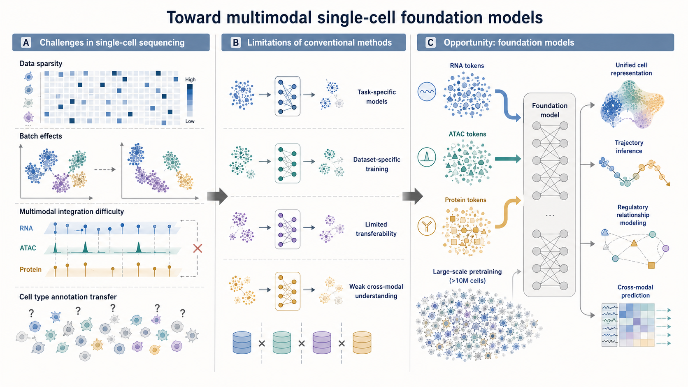

# 单细胞大模型背景

## 为什么需要单细胞多组学大模型？

**单细胞测序的挑战**

- **数据稀疏性**：dropout 事件导致大量零值
- **批次效应**：不同实验平台间系统性偏差
- **多模态整合**：RNA、ATAC、蛋白等模态联合分析困难
- **细胞类型注释**：跨数据集迁移标注成本高

**大模型的机遇**

- 预训练 + 微调范式已在 NLP/CV 取得突破
- 单细胞数据量级（>10M 细胞）支撑大规模预训练
- 基因表达可类比"细胞语言"进行序列建模

*图：单细胞大模型研究背景*

---

<!-- 
  第一部分：单细胞多组学大模型
  这页介绍研究背景和动机

  - layout: two-row 下文上图
  - 图片路径：../assets/figs_03/
-->
