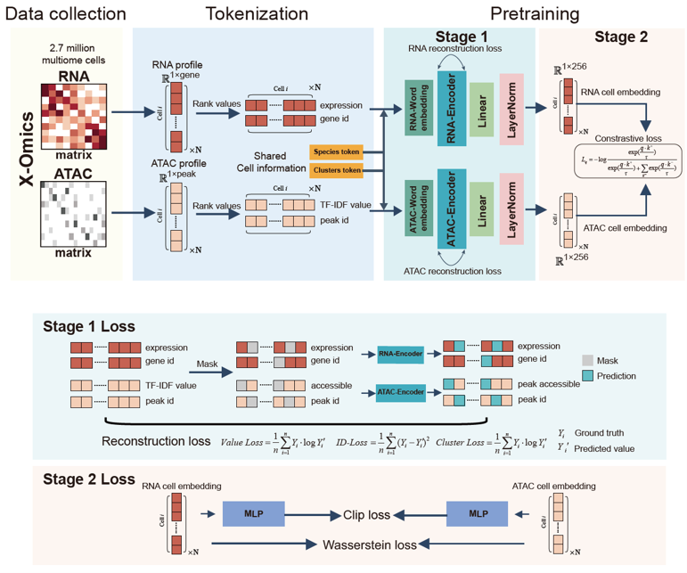

# 之前的工作：SCARF

## **Single Cell ATAC-seq and RNA-seq Foundation model**

**模型设计**

- 多模态编码器：分别编码 scRNA-seq 与 scATAC-seq
- 跨模态对齐：对比学习拉近同细胞不同模态表示
- 联合嵌入空间：统一下游分析（聚类、跨组学、细胞注释）

**训练数据**

| 数据集 | 细胞数 | 模态 |
|--------|--------|------|
| 10x Multiome | ~4M | RNA + ATAC |
| 10x scRNA-seq + 10xscATAC-seq（paired） | ~13M | RNA + ATAC |
| 10x scATAC-seq | ~4M | ATAC |

**核心贡献**

- 首次在最大规模单细胞多组学上验证对比预训练有效性
- 跨数据集零样本迁移注释准确率 **超过单组学大模型**

*图：SCARF 模型整体架构*

*图：SCARF 下游任务*

---

<!-- 
  这页介绍前期工作 SCARF

  - layout: two-column 左文右图
  - 图片路径：../assets/figs_04/
-->
