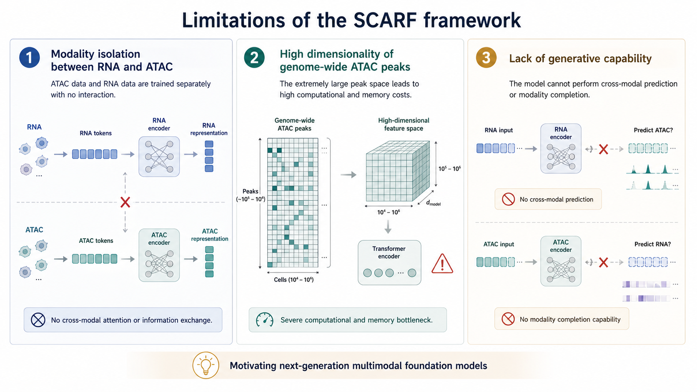

# SCARF 的问题

## **存在的问题**

**存在的问题**

1. **模态间不可见**：ATAC 数据与 RNA数据分开训练
3. **计算瓶颈**：全基因组 ATAC 峰矩阵维度过高（~500K）
4. **缺乏生成能力**：无法进行跨模态预测与补全

*图：SCARF 的问题*

---

<!-- 
  这页展示 SCARF 的结果和局限性

  - 图片路径：../assets/figs_05/
  -->
