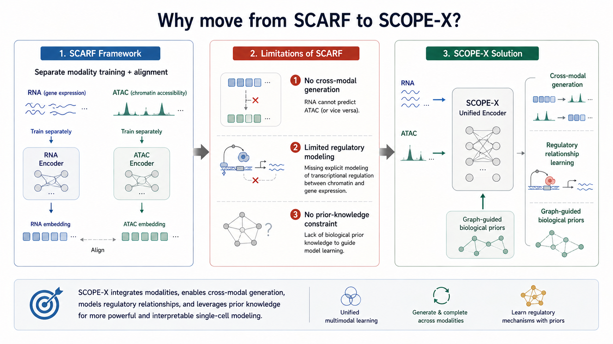

# SCOPE-X 研究方向定位

相对现有模型的差异化锚点：**统一表示 + 跨模态生成 + 零样本迁移**。

## 从 SCARF 到 SCOPE-X 的演进

**核心问题重新定义**

> 如何构建一个统一的单细胞多组学基础模型，同时具备**表示学习**、**跨模态生成**与**零样本迁移**能力？

**SCOPE-X 的三大目标**

1. **统一编码器**
   - 支持 RNA / ATAC 任意组合输入
   - 基因组位置感知的 tokenization

2. **跨模态生成**
   - 从 RNA 预测 ATAC 可及性
   - 缺失模态补全

3. **大规模预训练**
   - 训练数据：> 4M 细胞，覆盖 50+ 组织类型
   - 参数规模：~100M

*图：SCOPE-X 的优势*

---

<!-- 
  这页介绍 SCOPE-X 的研究方向
  - layout: two-column 左文右图
  - 图片路径：../assets/figs_06/
-->
