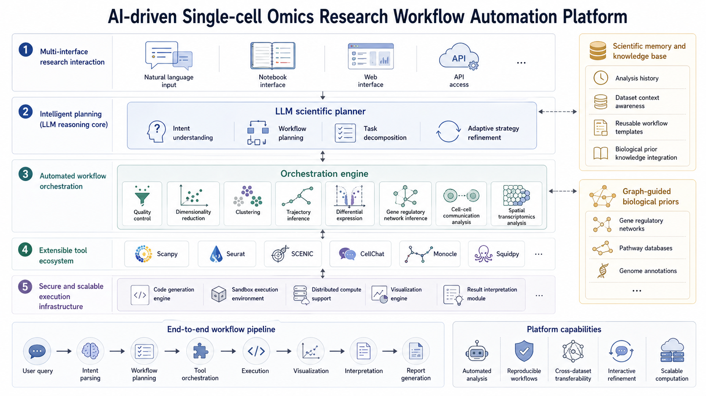

# 单细胞组学分析智能体

## 核心技术路线

本页默认上述架构已定义，并在该基础上展开后续消融分析与讨论。

**系统概述**

基于 LLM 的单细胞分析智能体，将自然语言指令转化为可执行的生物信息学分析流程。

**技术栈**

- **规划层**：LLM（GPT-4 / Claude）解析用户意图，生成分析计划
- **工具层**：封装 Scanpy / Seurat / SCENIC 等主流工具为 API
- **执行层**：代码生成 + 沙箱执行 + 结果解释
- **记忆层**：分析历史上下文，支持多轮对话

**工作流程**

```
用户输入 → 意图理解 → 工具选择 → 代码生成
                                    ↓
         结果解释 ← 可视化 ← 沙箱执行
```

**支持的分析类型**

- 质控、降维、聚类、轨迹推断
- 差异表达、基因调控网络
- 细胞通讯、空间转录组



*图：单细胞分析智能体整体架构*

---

<!-- 
  第二部分：单细胞组学分析智能体
  这页介绍核心技术路线
  - layout: two-column 左文右图
  - 图片路径：../assets/figs_08/
-->
