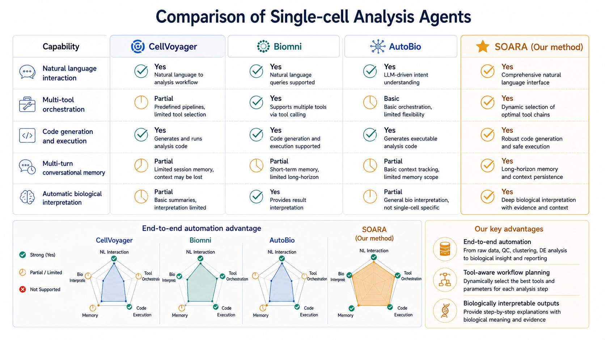

  - # 与现有工作的对比

  ## 单细胞分析智能体横向比较

  | 功能             | CellVoyager | Biomni | CellAgent | **我们的方法** |
  | ---------------- | :---------: | :----: | :-------: | :------------: |
  | 自然语言交互     |      ✅      |   ✅    |     ✅     |       ✅        |
  | 多工具编排       |      ⚠️      |   ✅    |     ✅     |       ✅        |
  | 代码生成执行     |      ✅      |   ✅    |     ✅     |       ✅        |
  | 多轮对话记忆     |      ⚠️      |   ⚠️    |     ⚠️     |       ✅        |
  | 结果自动解释     |      ✅      |   ✅    |     ✅     |       ✅        |
  | 单细胞任务专用化 |      ✅      |   ⚠️    |     ✅     |       ✅        |
  | 生物学先验整合   |      ⚠️      |   ⚠️    |     ⚠️     |       ✅        |
  | 安全可复现执行   |      ⚠️      |   ⚠️    |     ⚠️     |       ✅        |

  说明：✅ 表示公开资料中已有较明确支持；⚠️ 表示部分支持、实验性支持或公开细节不足。

  **核心差异化优势**

  - **端到端分析闭环**：从原始数据、质控、降维聚类到生物学解释的完整自动化流程
  - **工具感知规划**：根据数据类型、分析目标和中间结果动态选择合适工具链
  - **数据状态级记忆**：不仅记录对话历史，还记录 AnnData / Seurat 对象状态、已执行步骤和已确认结论
  - **图引导生物学先验**：将 marker、pathway、TF-target、ligand-receptor、ontology 等先验纳入任务规划、结果评分和解释
  - **安全可复现执行**：通过沙箱执行、版本锁定、日志记录和报告生成提高可部署性

  

  *图：各方法能力雷达图对比*

  ---

  <!-- 
    这页对比现有工作

    - theme: linear 深色背景突出表格
    - layout: chart 适合对比表格
    - 图片路径：../assets/figs_09/
  -->
